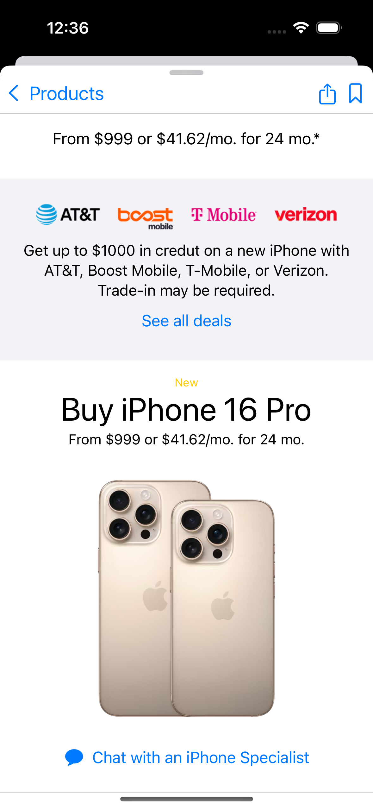
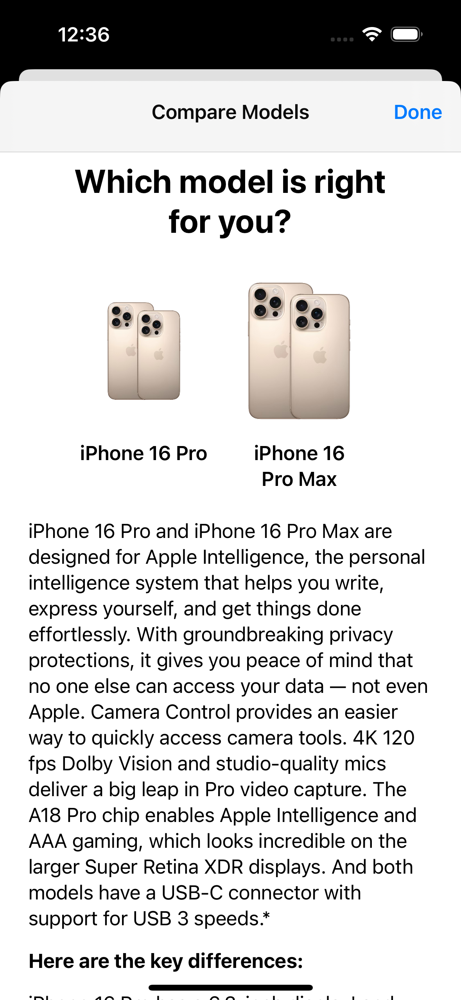
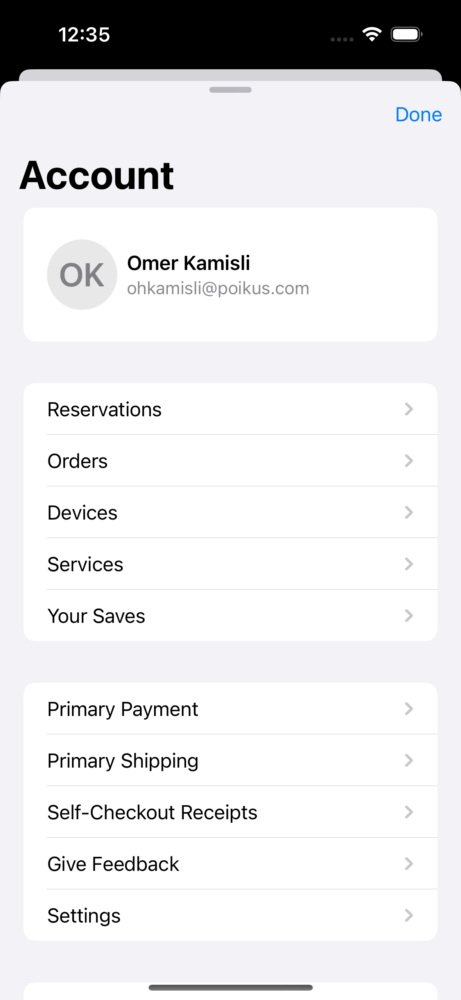

# AppleStoreDemo

## 📖 Overview

**AppleStoreDemo** is a mock Apple Store application designed to demonstrate the integration and capabilities of the **PKSNavigation** framework. This demo focuses on showcasing how to manage complex navigation flows, specifically:

- **Onboarding Flow**: Introducing new users to the app.
- **Product Listing & Detail**: Browsing and viewing detailed information about products.
- **Account Page**: Managing user account settings and information.

By utilizing PKSNavigation, AppleStoreDemo ensures a clean, maintainable, and scalable navigation structure, making it easier for developers to implement similar patterns in their own SwiftUI applications.

## 🌟 Features

- **Onboarding Flow**: Seamless introduction for first-time users.
- **Product Listing**: Browse a list of products with ease.
- **Product Detail**: Detailed view for iPhone 16 Pro.
- **Account Management**: View user account information.
- **Complex Navigation Management**: Leveraging PKSNavigation for stack-based navigation, sheet presentations, and full-screen covers.
- **Modular Architecture**: Clean separation of concerns for easy maintenance and scalability.
- **Comprehensive Logging**: Facilitates debugging and monitoring navigation flows.

## 📸 Screenshots

### Onboarding

| Onboarding Step 1                            | Onboarding Step 2                             | Onboarding Step 3                            | Notification Request                                 |
| -------------------------------------------- | --------------------------------------------- | -------------------------------------------- | ---------------------------------------------------- |
|  |  |  |  |

#### Onboarding How we use your data

| Main View                                                   | Detail View                                                        |
| ----------------------------------------------------------- | ------------------------------------------------------------------ |
|  |  |

### Product

#### Product Homepage


#### Product Detail

| As a Stack Navigation                            | As a Sheet                                       | As a FullScreenCover                           |
| ------------------------------------------------ | ------------------------------------------------ | ---------------------------------------------- |
|  |  |  |

<b>Showing compare models as a sheet.</b>

#### Details Sheet in the Product Detail



### Account Detail

| Account Detail                             | Account Detail Scroll                             | Account Detail Deeper Navigation                  |
| ------------------------------------------ | ------------------------------------------------- | ------------------------------------------------- |
|  |  |  |

> More Pages Coming Soon!

## 🚀 Getting Started

Follow these instructions to set up and run the AppleStoreDemo project on your local machine.

### Prerequisites

- **Xcode 16.0** or later
- **Swift 6** or later
- **iOS 16.0** or later

### Installation

1. **Clone the Repository**

   ```bash
   git clone https://github.com/POIKUS-LLC/PKSNavigationDemo.git
   ```

2. **Navigate to the Project Directory**

   ```bash
   cd PKSNavigationDemo
   ```

3. **Open the Project in Xcode**

   ```bash
   open applestore.xcodeproj
   ```

4. **Build and Run**

   Select the desired simulator or connected device and click the **Run** button in Xcode.

## 🔧 Usage

AppleStoreDemo demonstrates how to integrate and utilize **PKSNavigation** within a SwiftUI application. Below are key implementations and code snippets to guide you through the process.

## 🤝 Contributing

Contributions are welcome! Whether you found a bug, have a feature request, or want to improve the documentation, feel free to open an issue or submit a pull request.

1. **Fork the Repository**

2. **Create a Feature Branch**

   ```bash
   git checkout -b feature/YourFeature
   ```

3. **Commit Your Changes**

   ```bash
   git commit -m "Add your message"
   ```

4. **Push to the Branch**

   ```bash
   git push origin feature/YourFeature
   ```

5. **Open a Pull Request**

Please ensure your contributions adhere to the [Code of Conduct](CODE_OF_CONDUCT.md).

## 📜 License

This project is licensed under the [MIT License](LICENSE). You are free to use, modify, and distribute this software as per the license terms.

## 👨‍💼 Authors

**Omer Hamid KAMISLI**  
[GitHub](https://github.com/ohk) | [LinkedIn](https://linkedin.com/in/ohkamisli)  
Created on October 21, 2024
